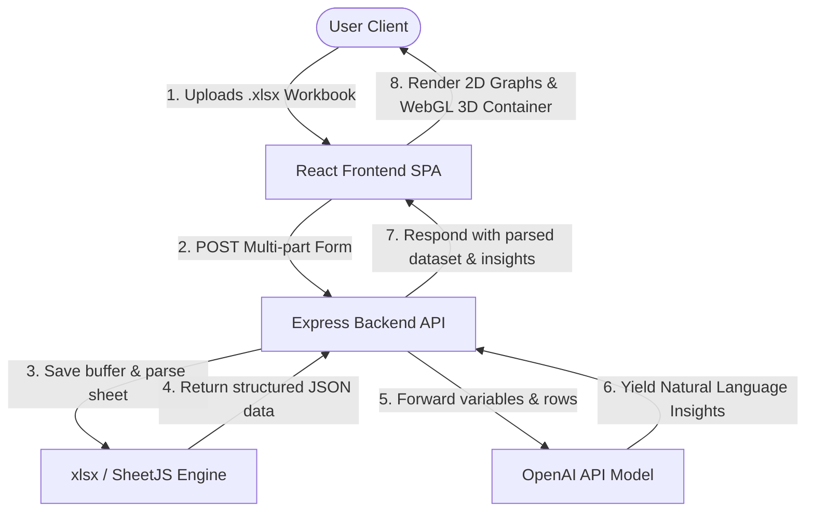

# 📊 ExcelViz — Excel Vista Insights Hub

<div align="center">
  
  
  
  
  
  
  
</div>

<p align="center">
  <strong>ExcelViz is a comprehensive, full-stack, enterprise-grade business intelligence platform. Upload spreadsheets, visualize data in interactive 2D and 3D graphs, view automated history logs, and query OpenAI-driven models for deep analytical summaries.</strong>
</p>

---

## 📖 Table of Contents
1. [System Overview](#-system-overview)
2. [Key Architecture Components](#-key-architecture-components)
3. [Monorepo / Workspace Layout](#-monorepo--workspace-layout)
4. [Prerequisites](#-prerequisites)
5. [Getting Started & Installation](#-getting-started--installation)
6. [Environment Configuration](#-environment-configuration)
7. [Running the Application](#-running-the-application)
8. [System Architecture Flow](#-system-architecture-flow)
9. [Detailed Technical Specifications](#-detailed-technical-specifications)
10. [License](#-license)

---

## 🌟 System Overview

ExcelViz bridges the gap between spreadsheet data and intelligent visualizations. Rather than scrolling through massive rows of data, users upload their Excel `.xls` or `.xlsx` workbooks, select visual parameters, and instantly view beautiful standard **2D charts** or spatial **3D charts**. In addition, the platform automatically feeds the calculated statistical distributions into advanced LLM processors to generate action-oriented executive summaries.

---

## 🛠️ Key Architecture Components

- **Frontend**: A highly responsive Single Page Application (SPA) built on **React 18**, **Tailwind CSS**, and **Redux Toolkit**. It utilizes **Three.js** for raw WebGL 3D rendering and **Chart.js** for robust 2D dashboard visualizers.
- **Backend**: A micro-service server built with **Node.js** and **Express.js**. It features automated file handling via **Multer**, secure sheet extraction via **SheetJS (xlsx)**, and asynchronous insights construction via the official **OpenAI SDK**.
- **Security & Database Integration**: User registration, session persistence, and API endpoint verification are governed securely by **Firebase Authentication** and **Firebase Admin SDK**.

---

## 📂 Monorepo / Workspace Layout

```text
ExcelViz/
├── backend/                # Node.js + Express backend service
│   ├── config/             # Config files (Firebase credentials, database connectors)
│   ├── controllers/        # Express business logic controllers
│   ├── middleware/         # Custom Express middlewares (authentication, logging)
│   ├── routes/             # RESTful API router tables
│   ├── uploads/            # Temporary storage buffer for file parsing
│   ├── server.js           # Backend entry-point and express bootstrapping
│   └── package.json        # Backend dependencies & custom dev scripts
├── frontend/               # React client application (powered by Create React App)
│   ├── src/                # Core client React modules
│   │   ├── app/            # Redux store setups
│   │   ├── components/     # High-fidelity reusable widgets (Chart3D, Chart2D, Uploaders)
│   │   ├── features/       # Redux slice logic
│   │   └── pages/          # Full viewport pages (Dashboard, Analysis, History, About)
│   ├── tailwind.config.js  # Color tokens and form styling specifications
│   └── package.json        # Frontend dependency configurations
├── package.json            # Monorepo/Root orchestrating configurations
└── README.md               # Main workspace documentation
```

---

## 📋 Prerequisites

Before starting, ensure you have the following installed on your system:
- **Node.js** (v16.x or newer)
- **npm** (v8.x or newer)
- A **Firebase Project** with Authentication enabled, and a generated private key (Admin SDK JSON).
- An **OpenAI API Key** for generating automated analysis insights.

---

## 🚀 Getting Started & Installation

To configure and boot both services simultaneously, follow this simple routine:

### 1. Clone & Core Setup
From the repository root directory, run the helper command to install dependencies across both the backend and frontend systems in one go:

```bash
npm run install-all
```

> [!NOTE]
> This command triggers nested installations using the pre-configured npm scripts in the root `package.json`.

---

## ⚙️ Environment Configuration

You must configure environment files in both the `backend` and `frontend` subdirectories.

### A. Backend Settings (`backend/.env`)
Create a `.env` file inside the `backend/` directory:

```env
PORT=5000
OPENAI_API_KEY=your_openai_api_key_here
FIREBASE_PROJECT_ID=your_firebase_project_id
# If storing the Firebase Admin Key as a local file:
FIREBASE_SERVICE_ACCOUNT_KEY_PATH=./config/firebase-service-account.json
```

### B. Frontend Settings (`frontend/.env`)
Create a `.env` file inside the `frontend/` directory:

```env
REACT_APP_API_URL=http://localhost:5000/api
```

---

## 🖥️ Running the Application

Once dependencies are installed and `.env` parameters are securely configured, fire up the concurrent local environment:

```bash
npm run dev
```

This single command triggers `concurrently` to launch:
- **Backend service** running at `http://localhost:5000` (monitored by nodemon for hot-reloading).
- **Frontend client** running at `http://localhost:3000` (auto-opens in your default browser).

### Root Scripts Reference

You can execute these helper commands directly from the root workspace directory:

| Script | Command | Action |
| :--- | :--- | :--- |
| `npm run install-all` | `npm install && ...` | Installs root dependencies, then targets both `backend` and `frontend` folders. |
| `npm run dev` | `concurrently ...` | Starts backend express server and React frontend in tandem. |
| `npm run server` | `cd backend && ...` | Launches the backend micro-service. |
| `npm run client` | `cd frontend && ...` | Launches the frontend React build server. |
| `npm run build` | `cd frontend && ...` | Prepares optimized React production bundle. |

---

## 🔄 System Architecture Flow



---

## 📑 Detailed Technical Specifications

### Data Parse & Extraction
Workbook files are loaded directly into RAM buffers in the backend using **Multer** and mapped into structured sheet matrices using **xlsx**. This ensures no permanent disk footprint is wasted, maintaining high API velocity.

### WebGL 3D Visualizer
The 3D coordinates module utilizes **Three.js** inside React hooks. It generates orthographic cameras, sets up dynamic grids, draws legend sprites, and plots individual rows as glowing 3D spheres or pillars.

### Authorization Protocol
All state-modifying requests send the secure Firebase User ID Token inside the `x-auth-token` HTTP header. Custom backend middleware verifies this token using the `firebase-admin` library before processing data or reading history records.

---

## 📄 License

This repository is private and licensed under the MIT License. Feel free to copy, modify, and integrate it into your workflows!
