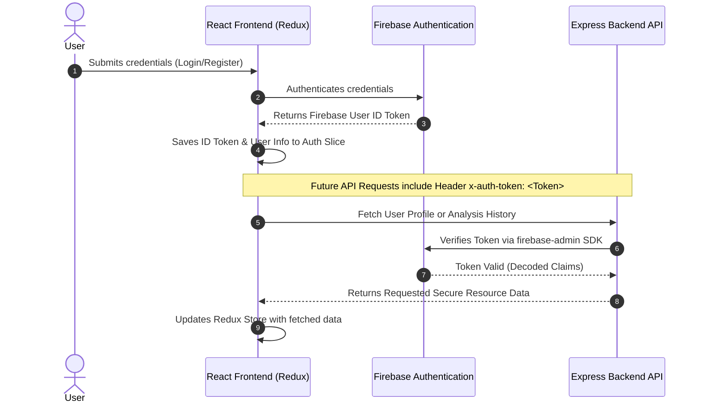

# 📊 Excel Vista Insights Hub — Frontend

<div align="center">
  
  
  
  
  
  
</div>

<p align="center">
  <strong>A premium, high-fidelity React application for uploading Excel workbooks, rendering breathtaking 2D & interactive 3D visualizations, and leveraging AI to generate instant analytical insights.</strong>
</p>

---

## 📖 Table of Contents

1. [Key Features](#-key-features)
2. [Aesthetics & User Experience](#-aesthetics--user-experience)
3. [Technology Stack](#-technology-stack)
4. [Architecture & Folder Structure](#-architecture--folder-structure)
5. [Local Environment Setup](#-local-environment-setup)
6. [Available Scripts](#-available-scripts)
7. [Routes & Page Breakdown](#-routes--page-breakdown)
8. [Component Directory](#-component-directory)
9. [Authentication & State Flow](#-authentication--state-flow)
10. [Exporting Capabilities](#-exporting-capabilities)
11. [License](#-license)

---

## ✨ Key Features

- 📁 **Seamless Workbook Parsing**: Upload `.xls` and `.xlsx` spreadsheets. The application parses the workbooks instantly on the backend and maps them to data schemas.
- 📈 **Dynamic 2D Visualizations**: Powered by `react-chartjs-2`, offering responsive line charts, bar charts, scatter plots, radar charts, and pie charts with beautiful interactive hover tooltips.
- 🧊 **Immersive 3D Visualizations**: Built with `three.js` to create spatial 3D data representations that let you rotate, zoom, and explore multidimensional datasets dynamically.
- 🤖 **AI-Powered Insights**: Get natural language business summaries, trend analysis, anomaly detections, and action items generated by OpenAI models based on sheet statistics.
- 🔐 **Robust Session Security**: Firebase Auth integration with secure state synchronization via Redux Toolkit and persistence across page refreshes.
- 📋 **Historical Analysis Logs**: Track previous uploads and analysis reports in a highly interactive table supporting paginated searches, sorting, and detail-view restoration.
- 📄 **Exportable Reports**: Generate instant visual exports of charts and insights in high-resolution PNG format or structured PDF files.

---

## 🎨 Aesthetics & User Experience

Excel Vista Insights Hub is designed to deliver a modern, premium enterprise dashboard experience:

- **Glassmorphism Layout**: Deep background blends, clean semi-transparent backdrops, and delicate border highlights.
- **Fluid Micro-Animations**: Smooth, responsive interactions using `framer-motion` for page transitions, hover states, card expansions, and menu reveals.
- **Harmonious Palette**: Sleek dark-mode aesthetic utilizing rich slate colors, glowing accents (indigo, emerald, violet), and elegant typography.
- **Responsive Fluidity**: Engineered from the ground up with flexible Tailwind grids and flexboxes, ensuring full usability across desktop workstations, tablets, and smartphones.

---

## 🛠️ Technology Stack

- **Core Framework**: React 18
- **State Management**: Redux Toolkit & React Redux (Slices for auth, analysis, history, and UI states)
- **Routing**: React Router DOM v6
- **Styling**: Tailwind CSS & Autoprefixer (with custom `@tailwindcss/forms` plugin)
- **Visualizations**: 
  - `chart.js` & `react-chartjs-2` for 2D visualization panels.
  - `three.js` for interactive WebGL-rendered 3D charts.
- **Exporting Modules**: `html2canvas` & `jspdf` for printing client reports.
- **Animations**: `framer-motion` for high-performance physics-based motion.
- **HTTP Client**: `axios` with interceptors for auth token delivery.

---

## 📂 Architecture & Folder Structure

The frontend is architected around a modular, feature-oriented structure for scalability:

```text
frontend/
├── public/                 # Static assets and index.html
├── src/
│   ├── app/                # Global configurations
│   │   └── store.js        # Global Redux Store initialization
│   ├── components/         # Reusable modular UI components
│   │   ├── Chart2D.jsx         # Custom wrappers for Chart.js
│   │   ├── Chart3D.jsx         # Three.js custom 3D WebGL renderer
│   │   ├── FileUpload.jsx      # Drag-and-drop dashboard file uploader
│   │   ├── HistoryTable.jsx    # Interactive history grid with actions
│   │   ├── InsightCard.jsx     # AI Insights viewer with micro-interactions
│   │   ├── Navbar.jsx          # Top dynamic utility navigation
│   │   ├── Sidebar.jsx         # Collapsible main navigation sidebar
│   │   ├── ProfileCard.jsx     # User metadata presentation cards
│   │   └── ProtectedRoute.jsx  # Authentication gate for private views
│   ├── config/             # Environment configs (e.g. Firebase SDK)
│   ├── features/           # Redux Slices (separated by domain)
│   │   ├── auth/               # User registration, login, and token state
│   │   ├── analysis/           # Current workbook sheets, coordinates, and configurations
│   │   ├── history/            # Fetched history runs, analytics logs, and cache
│   │   └── ui/                 # App-wide UI configuration (sidebar states, notifications)
│   ├── pages/              # Routed full page views
│   │   ├── Dashboard.jsx       # Aggregate dashboard overview, stats, and shortcuts
│   │   ├── Analysis.jsx        # Core analytics workspace (uploads, charts, AI summaries)
│   │   ├── History.jsx         # Full-page dedicated analysis registry
│   │   ├── Profile.jsx         # Account settings and session diagnostic panel
│   │   ├── About.jsx           # Conceptual goals, architecture details, and project info
│   │   ├── Login.jsx           # Clean glassmorphism login interface
│   │   ├── Register.jsx        # Account registration with feedback validations
│   │   └── ResetPassword.jsx   # Self-service credential recovery
│   ├── App.jsx             # Root layout wrapper and route switchboards
│   ├── index.css           # Core styling system, custom CSS utilities, & animations
│   └── index.js            # Entry point instantiating DOM & Redux context
├── tailwind.config.js      # Custom theme palettes, gradients, and font families
├── postcss.config.js       # PostCSS compiler rules
└── package.json            # Main dependency and script catalog
```

---

## 🚀 Local Environment Setup

### Prerequisites

Ensure you have [Node.js](https://nodejs.org/) installed (v16+ recommended) and a running instance of the ExcelViz Backend.

### Step-by-Step Installation

1. **Navigate to the frontend directory**:
   ```bash
   cd frontend
   ```

2. **Install project dependencies**:
   ```bash
   npm install
   ```

3. **Configure Environment Variables**:
   Create a `.env` file in the root of the `frontend` directory:
   ```env
   REACT_APP_API_URL=http://localhost:5000/api
   ```
   
   > [!NOTE]
   > Make sure the backend port matches your local running server (default is `5000`).

4. **Launch the Development Server**:
   ```bash
   npm start
   ```
   
   The application will compile and open at `http://localhost:3000`.

---

## 📜 Available Scripts

In the `frontend` directory, you can run the following standard scripts:

| Command | Description |
| :--- | :--- |
| `npm start` | Runs the app in development mode at `http://localhost:3000` with hot-reloading. |
| `npm run build` | Builds the application for production to the `build` folder, optimizing assets for peak performance. |
| `npm test` | Launches the interactive Jest test runner to validate components. |
| `npm run eject` | Ejects CRA configuration scripts (irreversible action). |

---

## 🗺️ Routes & Page Breakdown

The client application exposes a clear, structured flow across the following views:

- **🔐 Public Authentication Paths**:
  - `/login`: Secure Firebase credential gateway.
  - `/register`: Secure registration portal for new accounts.
  - `/reset-password`: Self-serve credential resets.

- **🛡️ Protected Application Paths (Requires Login)**:
  - `/dashboard`: Aggregate views displaying summary stats (total workbooks, total charts generated, latest run date) along with quick action shortcuts.
  - `/analysis`: Interactive workspace. Drag a workbook, select columns dynamically, select chart types (2D/3D), preview raw values, and trigger OpenAI business summaries.
  - `/history`: A master datagrid hosting all analysis runs, with immediate state recovery (click to reload past charts/AI summaries).
  - `/profile`: Session metadata validation, security audits, and account details.
  - `/about`: Detailed architectural summary, methodology behind data analytics, and credits.

---

## 🧩 Component Directory

### `Chart3D.jsx`
An advanced rendering component leveraging **Three.js**. It maps selected multi-column database parameters into interactive coordinates within a three-dimensional container.
- Supported interactions: Click-to-drag rotation, scroll-to-zoom, and multi-axes labels.
- Fully integrated with responsive resize listeners.

### `HistoryTable.jsx`
A high-performance interactive grid utilizing state cache to list previous analysis transactions.
- Fully supports query filtering, date-range narrowing, and pagination.
- Includes action triggers to delete, export, or reload historical files directly back into the analysis slice.

### `ProtectedRoute.jsx`
A wrapper guarding child elements. It intercepts unauthenticated routes and redirects users to `/login` while maintaining navigation memory for seamless post-login redirection.

---

## 🔒 Authentication & State Flow



---

## 💾 Exporting Capabilities

The application allows immediate, client-side export generation using canvas stitching:

1. **Image Snapshots (`html2canvas`)**: Renders DOM nodes containing charts and insight summaries directly into canvas representations, instantly converting them into `.png` format for download.
2. **Report Documents (`jspdf`)**: Aggregates parsed analytical text and chart snapshots into multi-page formatted PDF report layouts, ready for distribution.

---

> [!TIP]
> **Pro Tip**: When customizing styles, edit [tailwind.config.js](file:///c:/Users/UDIT%20PRASAD/OneDrive/Desktop/ExcelViz/frontend/tailwind.config.js) to leverage pre-defined brand color utilities and hover transforms. Keep components responsive by using standard Tailwind modifiers (`sm:`, `md:`, `lg:`).

## 📄 License

This frontend codebase is licensed under the MIT License. Feel free to fork, customize, and extend it!
